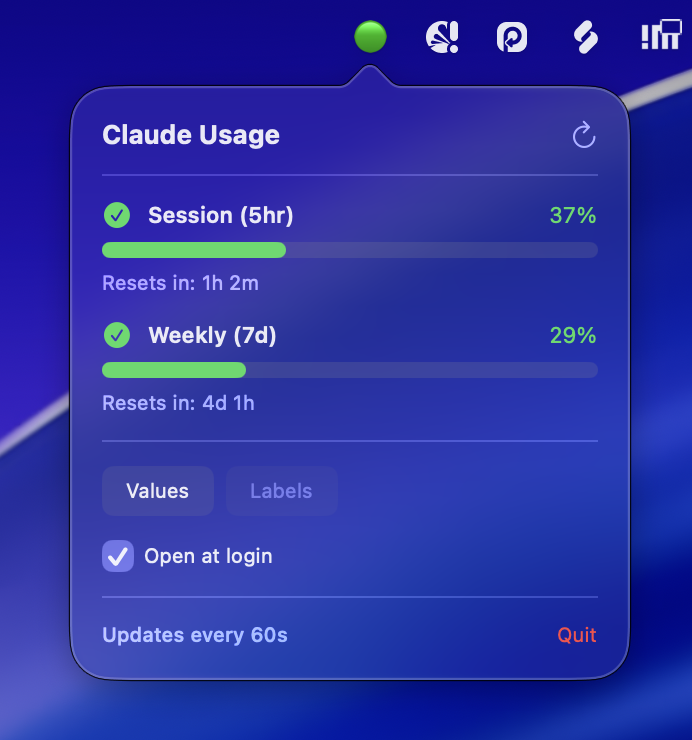

# Claude Usage Bar

[](https://opensource.org/licenses/MIT)
[](https://www.apple.com/macos/)
[](https://swift.org/)
[](https://support.apple.com/en-us/HT211814)

A macOS menu bar app that displays your Claude subscription usage (session & weekly limits) with color-coded status.

## Screenshots




## Features

- **Real-time usage display** - Shows 5-hour session and 7-day weekly usage percentages
- **Color-coded status**:
  - Red - Nearly exhausted (>90% used)
  - Orange - Burning too fast (usage % > time elapsed %)
  - Green - On track (usage % <= time elapsed %)
- **Click to expand** - Shows detailed breakdown and time until reset
- **Auto-refresh** - Updates every 60 seconds

## Display Format

```
23% | 45%
 ^      ^
 |      +-- Weekly (7-day) usage
 +-- Session (5-hour) usage
```

## Installation

### Option 1: DMG Download (Apple Silicon)

1. Download the latest `ClaudeUsageBar-x.x-arm64.dmg` from [Releases](https://github.com/aednzxy/ClaudeUsageBar/releases)
2. Open the DMG
3. Drag ClaudeUsageBar to Applications
4. See [Opening Unsigned Apps](#opening-unsigned-apps) for first launch

### Option 2: Build from Source

```bash
# Clone the repo
git clone https://github.com/aednzxy/ClaudeUsageBar.git
cd ClaudeUsageBar

# Build
./build.sh

# Run
open build/Build/Products/Release/ClaudeUsageBar.app
```

## Opening Unsigned Apps

This app is not signed with an Apple Developer certificate. On first launch:

**Method 1: Right-click**
1. Right-click (or Control-click) the app in Finder
2. Select "Open" from the menu
3. Click "Open" in the dialog

**Method 2: System Settings**
1. Try to open the app normally (it will be blocked)
2. Go to **System Settings** > **Privacy & Security**
3. Scroll down to find "ClaudeUsageBar was blocked"
4. Click **Open Anyway**

## Requirements

- macOS 12.0 or later
- Apple Silicon Mac (arm64)
- Claude Code CLI logged in (credentials in Keychain)

Intel Mac users can build from source - remove the `-arch arm64` flag from `build.sh`.

## Start at Login

1. Open **System Settings** > **General** > **Login Items**
2. Click **+** and add ClaudeUsageBar

Or via command line:
```bash
osascript -e 'tell application "System Events" to make login item at end with properties {path:"/Applications/ClaudeUsageBar.app", hidden:false}'
```

## How It Works

1. Reads OAuth token from macOS Keychain (`Claude Code-credentials`)
2. Calls the usage API endpoint
3. Calculates status based on usage vs time elapsed in period
4. Displays in menu bar with color coding

## Troubleshooting

**"No credentials found"**
- Make sure Claude Code CLI is installed and you're logged in
- Run `claude` in terminal and authenticate if needed

**"Error" in menu bar**
- Click to see detailed error message
- Check if Claude Code credentials are valid

## Disclaimer

This app uses an **undocumented API** to fetch usage data. It is:

- **Unofficial** - Not affiliated with or endorsed by Anthropic
- **Unsupported** - May break if the API changes
- **Use at your own risk** - No warranty provided

## Credits

Uses the undocumented Claude usage API discovered via [ccusage](https://github.com/ryoppippi/ccusage).

## License

[MIT License](LICENSE) - see LICENSE file for details.
